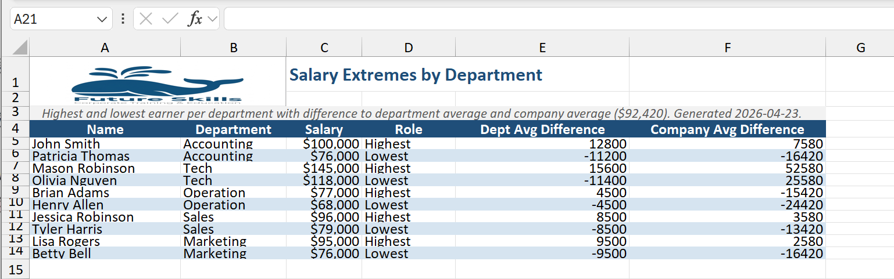

#Prompt:
/excel-report 1. Find out the highest and lowest salary per department.
2. Calculate the difference to the average salary in the department and the company.
3. Show the result in the report. It should include name, department, difference to department average and difference to company average.

