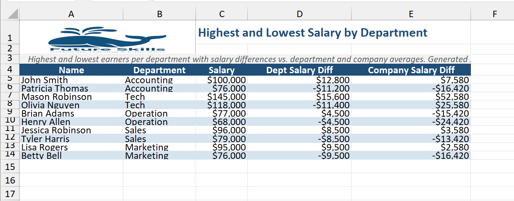

# Excel Report Skill

A Claude Code skill that turns a plain-language request into a polished, branded Excel report — no manual spreadsheet work required.

## How It Works

The workflow has three stages:

**1. Natural-language interpretation**
You invoke the skill with `/excel-report` followed by a description of what you want. Claude parses your request for filters, columns, sorting, grouping, aggregations, and any special formatting. No rigid syntax is required — write it the way you would explain it to a colleague.

**2. Data transformation**
Claude reads the employee dataset from `excel-report/resources/data.json` (50 employees across five departments: Accounting, Tech, Operation, Sales, and Marketing). It applies the logic you described — filtering rows, computing derived values like averages and differences, sorting, and grouping — and produces a clean list of records to render.

> **Extensible:** This step is intentionally decoupled from the data source. In the future it can be expanded to pull live data from other sources — for example, writing a SQL query and retrieving results from a SQL Server database, calling a REST API, or reading from a cloud data warehouse — before handing the records off to the report generator.

**3. Report generation**
Claude calls `excel-report/scripts/create_report.js`, a Node.js script backed by [ExcelJS](https://github.com/exceljs/exceljs), which assembles the final `.xlsx` file with a consistent layout every time:

| Row | Content |
|-----|---------|
| 1–2 | Company logo (top-left) + report title in bold dark-blue beside it |
| 3 | Italic summary sentence on a light-gray background, merged across all columns |
| 4 | Column headers — bold white text on a dark-blue background |
| 5+ | Data rows with alternating white / light-blue shading |

Additional formatting applied automatically:
- Salary and compensation columns rendered as `$#,##0` currency
- Column widths auto-fitted to content (capped at 40 characters)
- Output file saved to `output/` with a timestamp in the filename (e.g. `report_20260423_143012.xlsx`)

## Repository Structure

```
excel-report/
  SKILL.md                  ← skill definition loaded by Claude Code
  resources/
    data.json               ← source employee data (50 rows, 5 departments)
    company_logo.png        ← logo embedded in every report
  scripts/
    create_report.js        ← Node.js report builder (ExcelJS)
  evals/
    evals.json              ← test cases for validating skill output
```

## Usage

```
/excel-report <your request in plain English>
```

### Example prompt

```
/excel-report 1. Find out the highest and lowest salary per department.
2. Calculate the difference to the average salary in the department and the company.
3. Show the result in the report. It should include name, department, difference to department average and difference to company average.
```

### Example output



